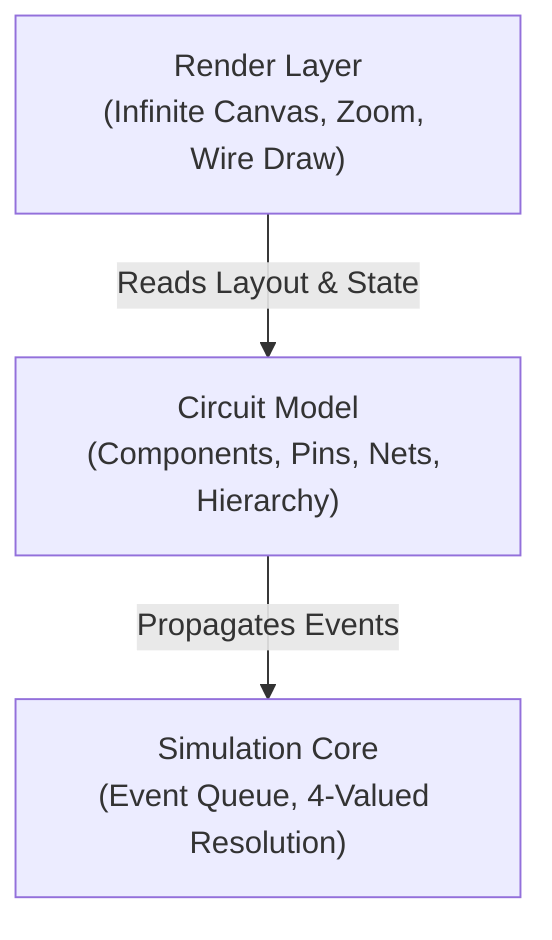

# LogicFlow

A snappy, modular 2D digital circuit simulator in TypeScript. It features an infinite canvas, four-valued logic resolution, interactive wiring, custom integrated circuit (IC) creation, and in-place hierarchical inspection ("transparent IC" mode).

---

## Features

- **Four-Valued Logic Engine:** Full support for `0` (LOW), `1` (HIGH), `Z` (High-Z / Floating), and `X` (Contention / Bus conflict).
- **Color-Coded Dynamic Wires:**
  - **Black:** 0V (LOW)
  - **Red:** 5V (HIGH)
  - **Ochre / Amber:** Floating (High-Z)
  - **Crimson / Highlight:** Contention error (`X`)
- **Infinite Canvas:** Smooth pan and zoom centered on your cursor with grid-snapping and viewport culling.
- **Component Palette:**
  - Inputs & Timing: Switches, push buttons, clocks.
  - Logic Gates: AND, OR, NOT, NAND, NOR, XOR, and Tri-State Buffers.
  - Outputs: Single-color LEDs, RGB LEDs, 7-Segment Displays.
- **Custom Modular ICs:** Select any circuit section and package it into a reusable chip with custom boundary pins.
- **Transparent IC Mode:** A global toggle that turns chip casings semi-transparent to reveal their internal gates, connections, and live wire states in real time.

---

## Architecture Overview

To keep the simulation fast and maintainable, the codebase is split into three decoupled modules:

1. **Simulation Core (Headless):** Operates without canvas or DOM dependencies. Runs an event-driven queue to evaluate logic state changes efficiently.
2. **Circuit Model:** Tracks components, pin connections, nets, and subcircuit definitions.
3. **Render Layer:** Handles canvas rendering, viewport coordinate transforms (`worldToScreen` / `screenToWorld`), Manhattan wire routing, and level-of-detail inspection.

---

## Implementation Roadmap

### Phase 1: Simulation Core
- [ ] Implement four-valued logic states (`0`, `1`, `Z`, `X`).
- [ ] Build a net resolution table to handle multi-driver bus arbitration and tri-state logic.
- [ ] Implement a discrete-event queue for gate propagation and state changes.
- [ ] Implement primitive gates: NOT, AND, OR, NAND, NOR, XOR, and Tri-State Buffer.
- [ ] Write unit tests for feedback loops (SR latch, clock toggling).

### Phase 2: Infinite Canvas & Viewport
- [ ] Set up an HTML5 2D canvas with resize listeners and Retina/HiDPI scaling.
- [ ] Implement camera transformations for infinite panning and zoom centered at cursor position.
- [ ] Implement coordinate conversion functions: `screenToWorld()` and `worldToScreen()`.
- [ ] Build grid snapping and spatial viewport culling (only render elements inside screen bounds).

### Phase 3: Interactive Wiring & Graph Extraction
- [ ] Add drag-and-drop component placement snapped to grid points.
- [ ] Implement orthogonal (Manhattan) wire drawing between pins.
- [ ] Build netlist extraction to merge connected wire segments into unified electrical nets.
- [ ] Connect the simulation engine to the render loop to dynamically color wires based on active net states.

### Phase 4: Inputs, Clocks & Visual Outputs
- [ ] Add interactive input controls: toggle switch, momentary push button, and periodic clock.
- [ ] Add display components: basic LED, RGB LED, and 7-segment display.
- [ ] Add visual state indicators and an interactive logic probe tool to check pin levels on hover.

### Phase 5: Modular ICs & Live Transparency
- [ ] Build subcircuit schema defining internal nets, child components, and exposed boundary pins.
- [ ] Implement the "Package into IC" feature to convert any selected subcircuit into a reusable component.
- [ ] Implement the **Transparent IC** mode:
  - Global toggle switch.
  - Draw IC package boundary with semi-transparent fill.
  - Recursively render internal gates, sub-nets, and live signal colors within the IC bounding box.
     
    
